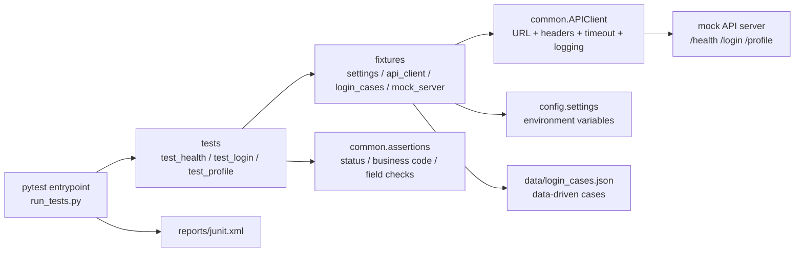

# Project A API Automation

Project A is a runnable API automation demo built with `pytest` and `requests`.
It shows how to organize an interface automation project with clear structure, environment configuration, reusable client code, seed data, smoke/regression suites, and JUnit report output.

## Background

The goal is to move from one-off API scripts to a maintainable automation project.

This project focuses on a small login/profile API domain:

- Health check: verify service availability.
- Login: cover success and common negative cases.
- Profile: verify token-based access and unauthorized access.

The project can run without an external backend because it includes a local mock API server for stable practice and interview demonstration.

## Architecture



## Structure

```text
project_a_api_automation/
  common/      Shared client, assertions, env loader, logger, mock API server
  config/      Runtime settings built from environment variables
  data/        Test data files
  docs/        Project notes, seed data, project structure, resume bullets
  reports/     Test output directory
  tests/       Pytest test cases and fixtures
```

Directory responsibilities:

| Directory | Responsibility |
|---|---|
| `tests/` | Test cases and pytest fixtures. Cases focus on behavior and assertions. |
| `common/` | Shared capabilities such as `APIClient`, assertions, logging, env loading, and mock server. |
| `data/` | Structured test data separated from test logic. |
| `config/` | Environment-driven runtime configuration. |
| `reports/` | Generated JUnit report and future HTML/Allure reports. |
| `docs/` | Project explanation, seed data, and interview materials. |

Seed data is documented in `docs/seed_data.md`.

## Quick Start

Install dependencies:

```powershell
python -m pip install -r requirements.txt
```

Run all tests:

```powershell
python run_tests.py
```

Expected result:

```text
5 passed
reports/junit.xml generated
```

By default, tests auto-start a local mock API server on `127.0.0.1:3100`.

## Environment

Copy `.env.example` to `.env` if you want to override defaults.

Important variables:

```text
TEST_ENV=dev
API_BASE_URL=http://127.0.0.1:3100
API_TIMEOUT=5
AUTO_START_MOCK=true
```

Run against the built-in mock service:

```powershell
$env:AUTO_START_MOCK="true"
python run_tests.py
```

Run against a real service:

```powershell
$env:AUTO_START_MOCK="false"
$env:API_BASE_URL="http://your-service-host:port"
python run_tests.py
```

When running against a real service, prepare equivalent seed data first. See `docs/seed_data.md`.

## Test Suites

Run smoke tests:

```powershell
python -m pytest -m smoke -v
```

Run regression tests:

```powershell
python -m pytest -m regression -v
```

Run all tests with report:

```powershell
python run_tests.py
```

Suite design:

| Suite | Purpose | Current Coverage |
|---|---|---|
| `smoke` | Fast release gate | health, login + token + profile |
| `regression` | Broader behavior checks | login data cases, unauthorized profile |

## Report

The project entrypoint writes a JUnit report to:

```text
reports/junit.xml
```

This report can be archived by CI systems such as Jenkins, GitHub Actions, or GitLab CI.

## Highlights

- Clear project layout: `tests / common / data / config / reports / docs`.
- Runnable by default: local mock server starts automatically during pytest.
- Environment-aware: `API_BASE_URL`, `API_TIMEOUT`, and `AUTO_START_MOCK` are injected through environment variables.
- Reusable request layer: `APIClient` centralizes URL building, headers, timeout, proxy isolation, latency logging, and request execution.
- Data-driven login coverage: login cases are stored in `data/login_cases.json`.
- Stable seed data: documented in `docs/seed_data.md` to reduce environment data noise.
- CI-ready entrypoint: `python run_tests.py` runs tests and generates `reports/junit.xml`.

## Interview Summary

In three minutes, describe it this way:

```text
I built a pytest-based API automation project for a login/profile API domain.
The project is organized into tests, common utilities, data, config, reports, and docs.
Request logic is centralized in APIClient, test data is externalized into JSON, environment values are injected through .env or CI variables, and reports are generated as JUnit XML.
The suite has smoke and regression markers, stable seed data, and a local mock server so reviewers can run it without external dependencies.
This shows not only API test writing, but also project structure, maintainability, environment management, and CI readiness.
```

